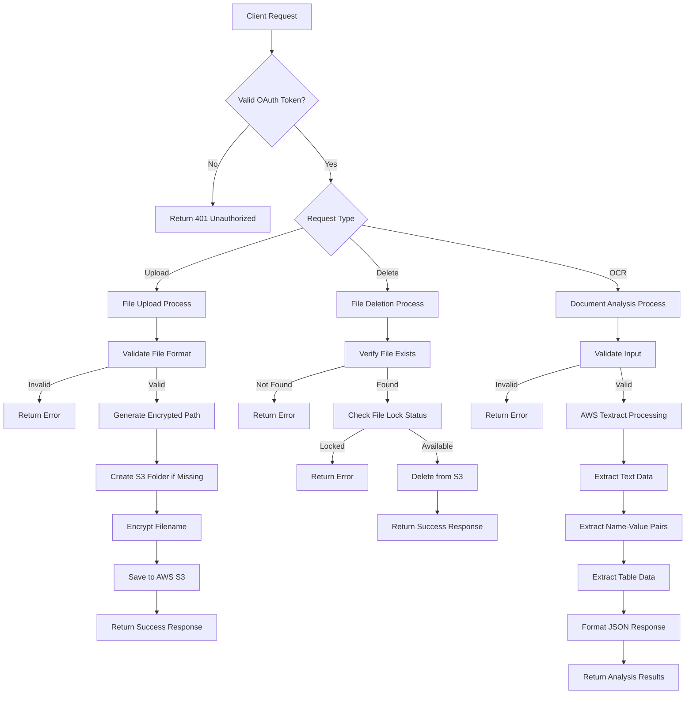
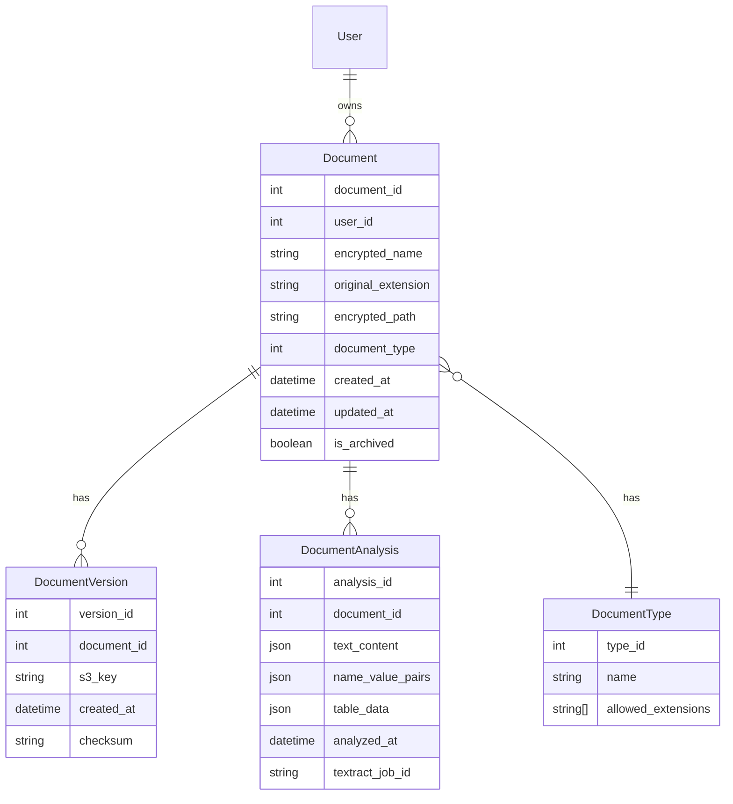
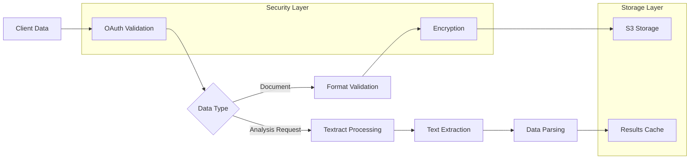
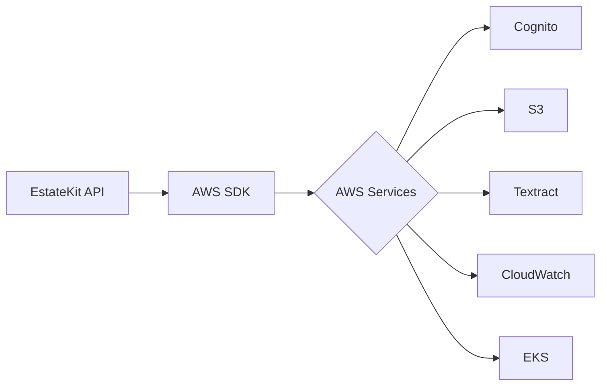

# Product Requirements Document (PRD)

# 1. INTRODUCTION

## 1.1 Purpose

This Software Requirements Specification (SRS) document provides a comprehensive description of the EstateKit Documents API implementation. It is intended for technical stakeholders including software developers, system architects, QA engineers, and project managers involved in the development and maintenance of the document storage and analysis system.

## 1.2 Scope

The EstateKit Documents API is a secure document management system that provides the following core functionalities:

- Secure document storage and retrieval using AWS S3
- Document analysis and text extraction using AWS Textract
- Document lifecycle management including upload, deletion, and archiving
- Authentication and authorization using AWS Cognito OAuth

The system will handle various document types including:

- Password files
- Medical documents
- Insurance documents
- Personal identifier documents

Key benefits include:

- Centralized and secure document storage
- Automated document analysis and data extraction
- Integration with existing EstateKit applications
- Compliance with financial regulatory requirements
- High availability and performance through AWS infrastructure

The API will support the following file formats:

- Images: PNG, JPEG, GIF, JPG
- Documents: DOC, DOCX, XLS, XLSX, CSV, PDF

# 2. PRODUCT DESCRIPTION

## 2.1 Product Perspective

The EstateKit Documents API is a component within the larger EstateKit application ecosystem, providing secure document management capabilities. The system integrates with the following external services and components:

- AWS S3 for secure document storage and retrieval
- AWS Textract for document analysis and OCR processing
- AWS Cognito for OAuth authentication and authorization
- AWS CloudWatch for logging and monitoring
- AWS EKS for container orchestration

The system operates as a REST API service built on .NET Core 9, serving as a middleware layer between EstateKit applications and AWS services.

## 2.2 Product Functions

The primary functions of the system include:

1. Document Management

   - Secure file upload with encryption
   - Document deletion
   - Folder structure management
   - File format validation

2. Document Analysis

   - OCR processing via AWS Textract
   - Text extraction and analysis
   - Table data extraction to CSV format
   - Name-value pair identification

3. Security Management

   - OAuth token validation
   - Document path encryption
   - Filename encryption
   - Access control enforcement

## 2.3 User Characteristics

The API is designed for integration with:

1. Technical Integration Teams

   - Software developers implementing EstateKit applications
   - System architects designing connected systems
   - Experience with REST APIs and OAuth authentication

2. Estate Management Applications

   - Web services requiring document storage
   - Systems needing automated document analysis
   - Applications managing user document lifecycles

## 2.4 Constraints

1. Technical Constraints

   - Must use .NET Core 9 framework
   - Limited to AWS service integration
   - Supported file formats:
     - Images: PNG, JPEG, GIF, JPG
     - Documents: DOC, DOCX, XLS, XLSX, CSV, PDF

2. Security Constraints

   - Mandatory OAuth authentication
   - Financial regulatory compliance requirements
   - End-to-end encryption requirement

3. Performance Constraints

   - 3-second maximum load time
   - 99.9% uptime requirement

## 2.5 Assumptions and Dependencies

Assumptions:

- AWS services will remain available and compatible
- OAuth tokens will be properly managed by client applications
- Document sizes will remain within AWS service limits

Dependencies:

1. External Services

   - AWS S3 availability
   - AWS Textract service
   - AWS Cognito OAuth service
   - AWS CloudWatch
   - AWS EKS

2. Environmental Requirements

   - Proper configuration of AWS credentials
   - Environment variables for service authentication
   - Network connectivity to AWS services

# 3. PROCESS FLOWCHART

# 4. FUNCTIONAL REQUIREMENTS

## 4.1 Document Upload Feature

### ID: F001

### Description

Secure file upload functionality that processes and stores documents in AWS S3.

### Priority

High

### Requirements

| ID | Requirement | Priority |
| --- | --- | --- |
| F001.1 | Validate OAuth token with AWS Cognito | Critical |
| F001.2 | Validate file format against allowed extensions (PNG, JPEG, GIF, JPG, DOC, DOCX, XLS, XLSX, CSV, PDF) | High |
| F001.3 | Generate encrypted document path key using user ID and document type | Critical |
| F001.4 | Create S3 folder structure if not exists | Medium |
| F001.5 | Encrypt filename while preserving extension | High |
| F001.6 | Upload file to AWS S3 with encrypted path and filename | Critical |
| F001.7 | Return success response with user ID, encrypted filename, and document path | Medium |

## 4.2 Document Deletion Feature

### ID: F002

### Description

Secure deletion of stored documents from AWS S3.

### Priority

Medium

### Requirements

| ID | Requirement | Priority |
| --- | --- | --- |
| F002.1 | Validate OAuth token with AWS Cognito | Critical |
| F002.2 | Verify file existence in S3 | High |
| F002.3 | Check file lock status | Medium |
| F002.4 | Execute secure deletion from S3 | High |
| F002.5 | Return deletion confirmation response | Low |

## 4.3 Document Analysis Feature

### ID: F003

### Description

OCR processing and data extraction using AWS Textract.

### Priority

High

### Requirements

| ID | Requirement | Priority |
| --- | --- | --- |
| F003.1 | Validate OAuth token with AWS Cognito | Critical |
| F003.2 | Process document through AWS Textract | High |
| F003.3 | Extract text content from document | High |
| F003.4 | Identify and extract name-value pairs | Medium |
| F003.5 | Extract and format table data as CSV | Medium |
| F003.6 | Generate JSON response with extracted data | High |
| F003.7 | Handle both document path and byte array inputs | Medium |

## 4.4 Security Management Feature

### ID: F004

### Description

Security and authentication management across all operations.

### Priority

Critical

### Requirements

| ID | Requirement | Priority |
| --- | --- | --- |
| F004.1 | Implement OAuth token validation | Critical |
| F004.2 | Manage AWS service credentials via environment variables | High |
| F004.3 | Implement end-to-end encryption for document storage | Critical |
| F004.4 | Enforce financial regulatory compliance requirements | Critical |
| F004.5 | Implement secure path and filename encryption | High |
| F004.6 | Validate user permissions for document operations | High |

## 4.5 Document Management Feature

### ID: F005

### Description

Core document management functionality including organization and lifecycle management.

### Priority

High

### Requirements

| ID | Requirement | Priority |
| --- | --- | --- |
| F005.1 | Organize documents by type (Password, Medical, Insurance, Personal) | High |
| F005.2 | Maintain encrypted folder structure | High |
| F005.3 | Handle document versioning | Medium |
| F005.4 | Implement document archiving functionality | Medium |
| F005.5 | Validate document metadata | Medium |
| F005.6 | Handle concurrent document operations | High |

# 5. NON-FUNCTIONAL REQUIREMENTS

## 5.1 Performance Requirements

| Requirement | Description | Target Metric |
| --- | --- | --- |
| Response Time | Maximum API response time for standard operations | \< 3 seconds |
| File Upload Speed | Maximum time for document upload processing | \< 5 seconds for files up to 10MB |
| OCR Processing | Maximum time for Textract analysis completion | \< 30 seconds per document |
| Concurrent Users | Number of simultaneous API requests supported | 1000 requests per minute |
| Resource Usage | Maximum memory consumption per instance | \< 2GB RAM |
| API Throughput | Sustained request handling capacity | 100,000 requests per day |

## 5.2 Safety Requirements

| Requirement | Description |
| --- | --- |
| Data Backup | Automated daily backups of all stored documents |
| Failure Recovery | Automatic failover to redundant systems within 30 seconds |
| Data Integrity | Checksum verification for all file operations |
| Transaction Safety | Atomic operations for all document modifications |
| Error Handling | Comprehensive error logging and notification system |
| Version Control | Document version history maintained for 90 days |

## 5.3 Security Requirements

| Requirement | Description |
| --- | --- |
| Authentication | Mandatory AWS Cognito OAuth authentication for all API requests |
| Authorization | Role-based access control for document operations |
| Data Encryption | AES-256 encryption for stored documents |
| Transport Security | TLS 1.3 for all API communications |
| Key Management | AWS KMS for encryption key management |
| Access Logging | Detailed audit trails for all document operations |
| Session Management | Token expiration after 1 hour of inactivity |

## 5.4 Quality Requirements

### 5.4.1 Availability

- System uptime: 99.9% excluding planned maintenance
- Maximum planned downtime: 4 hours per month
- Disaster recovery time objective: \< 4 hours

### 5.4.2 Maintainability

- Code documentation coverage: 100%
- Unit test coverage: minimum 80%
- Automated deployment capability
- Infrastructure as Code implementation

### 5.4.3 Usability

- RESTful API compliance
- Consistent error message format
- Comprehensive API documentation
- Standard HTTP status codes

### 5.4.4 Scalability

- Horizontal scaling capability up to 10x normal load
- Auto-scaling based on CPU utilization (70% threshold)
- Load balancing across multiple availability zones
- Elastic container scaling in AWS EKS

### 5.4.5 Reliability

- Zero data loss tolerance
- Automatic retry mechanism for failed operations
- Circuit breaker implementation for external services
- Cross-region redundancy

## 5.5 Compliance Requirements

| Requirement | Description |
| --- | --- |
| Data Protection | GDPR compliance for personal data handling |
| Financial Standards | SOC 2 Type II compliance |
| Security Standards | OWASP Top 10 security compliance |
| API Standards | OpenAPI Specification 3.0 compliance |
| Cloud Security | AWS Well-Architected Framework compliance |
| Audit Requirements | Maintain comprehensive audit logs for 7 years |
| Data Retention | Implement data retention policies as per regulatory requirements |

# 6. DATA REQUIREMENTS

## 6.1 Data Models

## 6.2 Data Storage

### 6.2.1 Primary Storage

- AWS S3 for document storage with the following structure:
  - Bucket: `estatekit-documents-{environment}`
  - Path format: `/{encrypted_user_id}/{document_type}/{encrypted_filename}`

### 6.2.2 Data Retention

- Active documents: Indefinite retention
- Archived documents: 7-year retention period
- Document versions: 90-day retention
- Analysis results: 30-day cache period
- Audit logs: 7-year retention

### 6.2.3 Backup Strategy

- Cross-region replication to secondary AWS region
- Daily incremental backups
- Weekly full backups
- Monthly archive snapshots
- Retention of 7 years for compliance

### 6.2.4 Recovery Procedures

- Point-in-time recovery capability up to 35 days
- Recovery Time Objective (RTO): 4 hours
- Recovery Point Objective (RPO): 15 minutes
- Automated failover to secondary region

## 6.3 Data Processing

### 6.3.1 Data Security

- AES-256 encryption for all stored documents
- Encryption at rest using AWS KMS
- TLS 1.3 for data in transit
- Field-level encryption for sensitive metadata
- Encrypted document paths and filenames

### 6.3.2 Data Validation

- File format verification against allowed extensions
- Maximum file size: 100MB
- Document integrity verification via checksums
- Metadata schema validation
- Input sanitization for all fields

### 6.3.3 Data Transformation

- Document text extraction via AWS Textract
- Table data conversion to CSV format
- Name-value pair extraction
- JSON response formatting
- Binary to text encoding for document transfer

# 7. EXTERNAL INTERFACES

## 7.1 Software Interfaces

| Interface | Description | Protocol/Format | Security |
| --- | --- | --- | --- |
| AWS Cognito | OAuth authentication service | REST/HTTPS | OAuth 2.0, JWT tokens |
| AWS S3 | Document storage service | AWS SDK/.NET | AWS IAM, AES-256 |
| AWS Textract | Document analysis service | AWS SDK/.NET | AWS IAM |
| AWS CloudWatch | Logging and monitoring | AWS SDK/.NET | AWS IAM |
| AWS EKS | Container orchestration | Kubernetes API | AWS IAM, RBAC |

### 7.1.1 AWS Service Integration Requirements

### 7.1.2 API Specifications

- REST API endpoints
- OpenAPI 3.0 compliant
- JSON request/response format
- HTTP/2 protocol support
- TLS 1.3 encryption

## 7.2 Communication Interfaces

### 7.2.1 Network Requirements

- HTTPS (TLS 1.3) for all API communications
- TCP/IP protocol stack
- WebSocket support for real-time notifications
- Load balancer integration
- Cross-region communication capability

### 7.2.2 Data Exchange Formats

| Format | Use Case | Validation |
| --- | --- | --- |
| JSON | API requests/responses | JSON Schema |
| Binary | Document upload/download | Checksum verification |
| CSV | Table data export | RFC 4180 compliance |
| JWT | Authentication tokens | RS256 signature |

### 7.2.3 API Response Codes

| Code | Description | Usage |
| --- | --- | --- |
| 200 | Success | Successful operations |
| 201 | Created | Resource creation |
| 400 | Bad Request | Invalid input |
| 401 | Unauthorized | Invalid/missing token |
| 403 | Forbidden | Insufficient permissions |
| 404 | Not Found | Resource not found |
| 500 | Server Error | Internal errors |

## 7.3 Hardware Interfaces

### 7.3.1 AWS Infrastructure Requirements

- EKS node specifications:
  - Minimum 4 vCPUs
  - 16GB RAM
  - 100GB SSD storage
- Network interface requirements:
  - 10Gbps network connectivity
  - Support for AWS VPC
  - Multiple availability zone support

### 7.3.2 Client Requirements

- Network bandwidth: Minimum 1Mbps
- TLS 1.3 capable networking stack
- Support for HTTP/2 protocol
- IPv4 and IPv6 compatibility

# 8. APPENDICES

## 8.1 ADDITIONAL INFORMATION

- Document path key generation uses a combination of user ID and document type for enhanced security
- Document type mapping:
  1. Password files
  2. Medical
  3. Insurance
  4. Personal identifiers
- Environment variables are used for all AWS service credentials including:
  - AWS S3 access keys
  - AWS Textract credentials
  - AWS Cognito client configuration
  - AWS CloudWatch settings

## 8.2 GLOSSARY

| Term | Definition |
| --- | --- |
| Document Path Key | Encrypted value combining user ID and document type used for S3 folder structure |
| Estate Kit | The parent application ecosystem that this API serves |
| OCR | Optical Character Recognition - technology used to extract text from images and documents |
| Name-Value Pair | A data structure containing a labeled identifier and its corresponding value |
| Byte Array | A sequence of bytes representing document data in binary format |

## 8.3 ACRONYMS

| Acronym | Definition |
| --- | --- |
| API | Application Programming Interface |
| AWS | Amazon Web Services |
| EKS | Elastic Kubernetes Service |
| IAM | Identity and Access Management |
| JSON | JavaScript Object Notation |
| JWT | JSON Web Token |
| KMS | Key Management Service |
| OAuth | Open Authorization |
| REST | Representational State Transfer |
| S3 | Simple Storage Service |
| SDK | Software Development Kit |
| TLS | Transport Layer Security |
| VPC | Virtual Private Cloud |

## 8.4 ADDITIONAL REFERENCES

1. AWS Documentation

   - [AWS S3 Developer Guide](https://docs.aws.amazon.com/AmazonS3/latest/dev/Welcome.html)
   - [AWS Textract Documentation](https://docs.aws.amazon.com/textract/latest/dg/what-is.html)
   - [AWS Cognito Documentation](https://docs.aws.amazon.com/cognito/latest/developerguide/what-is-amazon-cognito.html)

2. Technical Standards

   - [OpenAPI Specification 3.0](https://swagger.io/specification/)
   - [OAuth 2.0 Specification](https://oauth.net/2/)
   - [RFC 4180 - CSV Format](https://tools.ietf.org/html/rfc4180)

3. Security Standards

   - [OWASP Top 10](https://owasp.org/www-project-top-ten/)
   - [SOC 2 Compliance](https://www.aicpa.org/interestareas/frc/assuranceadvisoryservices/sorhome.html)
   - [GDPR Requirements](https://gdpr.eu/)