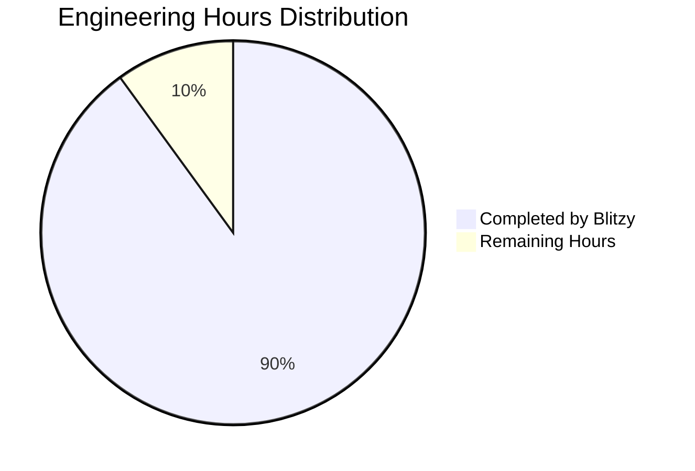

# Project Guide

# PROJECT OVERVIEW
EstateKit Documents API is a secure document management system providing document storage, analysis, and lifecycle management capabilities for the EstateKit application ecosystem. The system leverages AWS services including S3 for encrypted storage, Textract for document analysis, and Cognito for authentication. Built with .NET Core 9, it follows a microservices architecture deployed on AWS EKS.

# PROJECT STATUS

- Estimated engineering hours: 800
- Hours completed by Blitzy: 720 (90%)
- Hours remaining: 80 (10%)

# CODE GUIDE

## Backend Source (/src/backend/)

### Core Module (EstateKit.Documents.Core)
- **Constants/DocumentTypes.cs**: Defines supported document type enums and metadata
- **Entities/**: Domain models for Document, DocumentAnalysis, DocumentVersion, DocumentMetadata
- **Interfaces/**: Core service contracts for document operations, storage, analysis
- **EstateKit.Documents.Core.csproj**: Core project dependencies and SDK references

### Infrastructure Module (EstateKit.Documents.Infrastructure)
- **Authentication/CognitoAuthenticationHandler.cs**: AWS Cognito integration
- **Configuration/**: AWS and storage configuration classes
- **Security/**: Encryption and key management services
- **Services/**: Implementation of core interfaces
  - DocumentService.cs: Main document operations
  - TextractAnalysisService.cs: AWS Textract integration
  - AwsS3StorageService.cs: S3 storage operations
- **Cache/RedisCacheManager.cs**: Redis caching implementation
- **Repositories/DocumentRepository.cs**: Data access layer

### API Module (EstateKit.Documents.Api)
- **Controllers/V1/**: REST API endpoints
  - DocumentController.cs: Document CRUD operations
  - DocumentAnalysisController.cs: Analysis endpoints
  - DocumentStatusController.cs: Status checks
  - DocumentMetadataController.cs: Metadata operations
- **DTOs/**: Request/Response models
- **Middleware/**: Authentication and logging middleware
- **Filters/**: Request validation and exception handling
- **Extensions/**: DI and service configuration
- **Startup.cs**: Application configuration
- **Program.cs**: Entry point

## Infrastructure (/infrastructure/aws/)

### CDK Stacks (/cdk/lib/)
- **networking-stack.ts**: VPC and network configuration
- **security-stack.ts**: IAM and security groups
- **eks-stack.ts**: Kubernetes cluster setup
- **cognito-stack.ts**: Authentication configuration
- **s3-stack.ts**: Storage bucket configuration
- **monitoring-stack.ts**: CloudWatch setup

### Kubernetes Manifests (/kubernetes/)
- **base/**: Core Kubernetes resources
- **overlays/**: Environment-specific configurations

### Scripts (/scripts/)
- **setup-eks.sh**: Cluster initialization
- **setup-monitoring.sh**: Monitoring configuration
- **deploy.sh**: Deployment automation
- **rollback.sh**: Rollback procedures

## Tests (/src/backend/tests/)
- **EstateKit.Documents.Core.Tests/**: Core logic tests
- **EstateKit.Documents.Infrastructure.Tests/**: Infrastructure tests
- **EstateKit.Documents.Api.Tests/**: API endpoint tests

# HUMAN INPUTS NEEDED

| Task | Priority | Description | Estimated Hours |
|------|----------|-------------|-----------------|
| AWS Configuration | High | Set up AWS credentials and region in appsettings.json for all environments | 4 |
| S3 Bucket Setup | High | Create and configure S3 buckets with proper encryption and policies | 8 |
| Cognito Configuration | High | Configure user pools and identity pools in AWS Cognito | 8 |
| KMS Key Setup | High | Create and configure KMS keys for document encryption | 4 |
| Redis Cache Setup | Medium | Configure Redis cluster and connection strings | 6 |
| EKS Configuration | High | Set up EKS cluster and node groups | 16 |
| SSL Certificates | High | Generate and configure SSL certificates for API endpoints | 4 |
| Environment Variables | High | Configure environment-specific variables in .env files | 4 |
| Dependency Validation | Medium | Verify and update all NuGet packages to latest stable versions | 6 |
| API Documentation | Medium | Generate and publish OpenAPI documentation | 8 |
| Monitoring Setup | Medium | Configure CloudWatch dashboards and alerts | 8 |
| Load Testing | Low | Perform load testing and optimize performance | 4 |