# Technical Specifications

# 1. INTRODUCTION

## 1.1 EXECUTIVE SUMMARY

The EstateKit Documents API is a secure document management system designed to provide document storage, analysis, and lifecycle management capabilities for the EstateKit application ecosystem. This system addresses the critical need for secure document handling in estate management by providing encrypted storage in AWS S3, automated document analysis through AWS Textract, and comprehensive document lifecycle management. Primary stakeholders include EstateKit applications and integrated web services requiring secure document processing capabilities. The system will deliver significant value through automated document analysis, secure storage, and regulatory compliance, enabling efficient estate document management at scale.

## 1.2 SYSTEM OVERVIEW

### Project Context

| Aspect | Description |
| --- | --- |
| Business Context | Core document management infrastructure for EstateKit ecosystem |
| Current Limitations | Need for centralized, secure document storage and analysis |
| Enterprise Integration | Integrates with existing EstateKit applications via REST API |

### High-Level Description

| Component | Implementation |
| --- | --- |
| Storage Layer | AWS S3 with AES-256 encryption |
| Analysis Engine | AWS Textract for OCR and data extraction |
| Authentication | AWS Cognito OAuth service |
| API Framework | .NET Core 9 REST API |
| Infrastructure | AWS EKS container orchestration |

### Success Criteria

| Criteria | Target Metric |
| --- | --- |
| System Performance | Response time \< 3 seconds |
| System Availability | 99.9% uptime |
| Security Compliance | Financial regulatory standards met |
| Data Accuracy | 98% OCR accuracy rate |

## 1.3 SCOPE

### In-Scope

#### Core Features and Functionalities

| Feature Category | Components |
| --- | --- |
| Document Management | File upload, deletion, archiving |
| Document Analysis | OCR processing, text extraction, table parsing |
| Security | OAuth authentication, encryption, access control |
| File Types | Images (PNG, JPEG, GIF, JPG), Documents (DOC, DOCX, XLS, XLSX, CSV, PDF) |

#### Implementation Boundaries

| Boundary Type | Coverage |
| --- | --- |
| System Access | EstateKit applications and authorized web services |
| Document Types | Password files, Medical, Insurance, Personal identifiers |
| Infrastructure | AWS cloud services |
| Authentication | OAuth token-based access |

### Out-of-Scope

- Direct user interface or frontend components
- Document editing or manipulation capabilities
- Real-time document collaboration features
- Integration with non-AWS cloud providers
- Manual document classification
- Legacy system migration tools
- Mobile-specific optimizations
- Offline document processing capabilities

# 2. SYSTEM ARCHITECTURE

## 2.1 High-Level Architecture

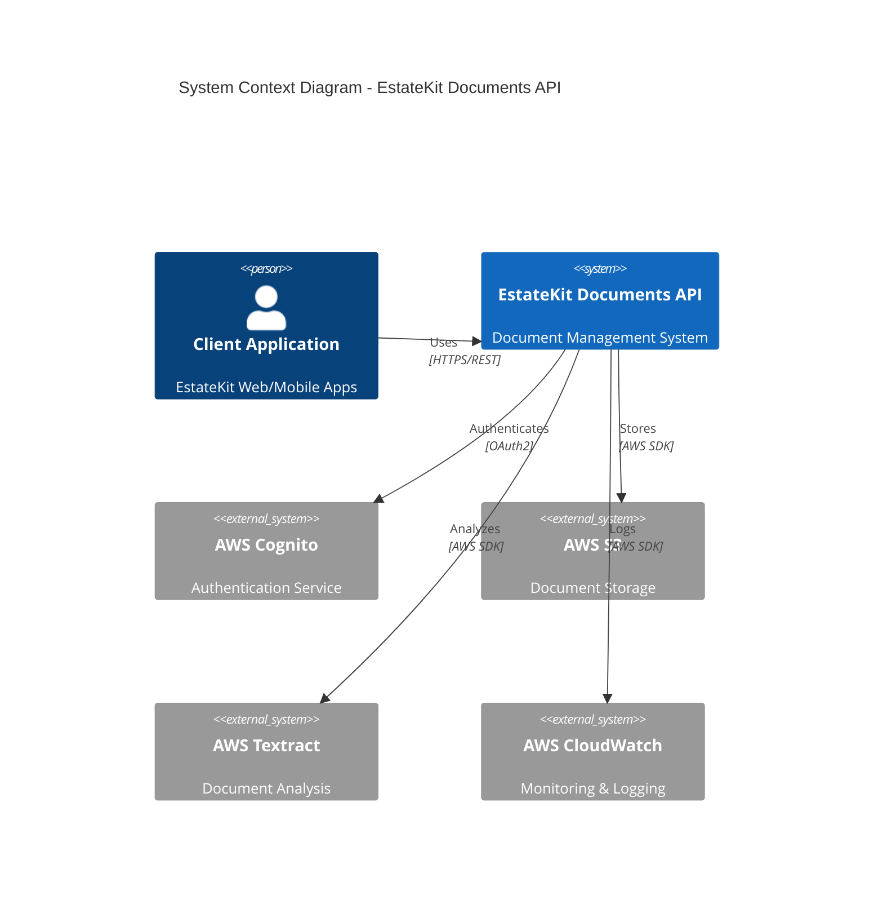
```mermaid
C4Context
    title System Context Diagram - EstateKit Documents API

    Person(client, "Client Application", "EstateKit Web/Mobile Apps")
    System(api, "EstateKit Documents API", "Document Management System")
    
    System_Ext(cognito, "AWS Cognito", "Authentication Service")
    System_Ext(s3, "AWS S3", "Document Storage")
    System_Ext(textract, "AWS Textract", "Document Analysis")
    System_Ext(cloudwatch, "AWS CloudWatch", "Monitoring & Logging")
    
    Rel(client, api, "Uses", "HTTPS/REST")
    Rel(api, cognito, "Authenticates", "OAuth2")
    Rel(api, s3, "Stores", "AWS SDK")
    Rel(api, textract, "Analyzes", "AWS SDK")
    Rel(api, cloudwatch, "Logs", "AWS SDK")
```

## 2.2 Component Details

### 2.2.1 Container Architecture

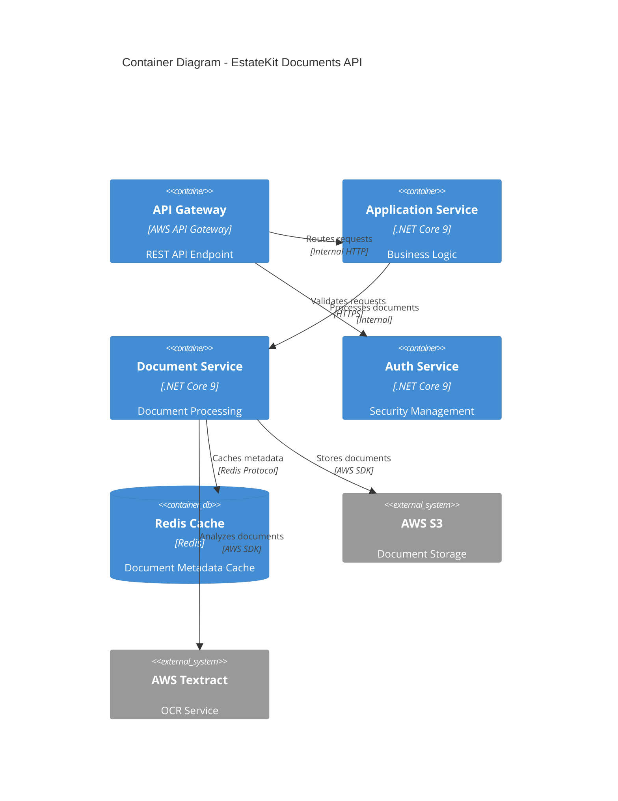
```mermaid
C4Container
    title Container Diagram - EstateKit Documents API

    Container(api_gateway, "API Gateway", "AWS API Gateway", "REST API Endpoint")
    Container(app_service, "Application Service", ".NET Core 9", "Business Logic")
    Container(doc_service, "Document Service", ".NET Core 9", "Document Processing")
    Container(auth_service, "Auth Service", ".NET Core 9", "Security Management")
    
    ContainerDb(cache, "Redis Cache", "Redis", "Document Metadata Cache")
    
    System_Ext(s3, "AWS S3", "Document Storage")
    System_Ext(textract, "AWS Textract", "OCR Service")
    
    Rel(api_gateway, auth_service, "Validates requests", "HTTPS")
    Rel(api_gateway, app_service, "Routes requests", "Internal HTTP")
    Rel(app_service, doc_service, "Processes documents", "Internal")
    Rel(doc_service, s3, "Stores documents", "AWS SDK")
    Rel(doc_service, textract, "Analyzes documents", "AWS SDK")
    Rel(doc_service, cache, "Caches metadata", "Redis Protocol")
```

### 2.2.2 Component Interactions

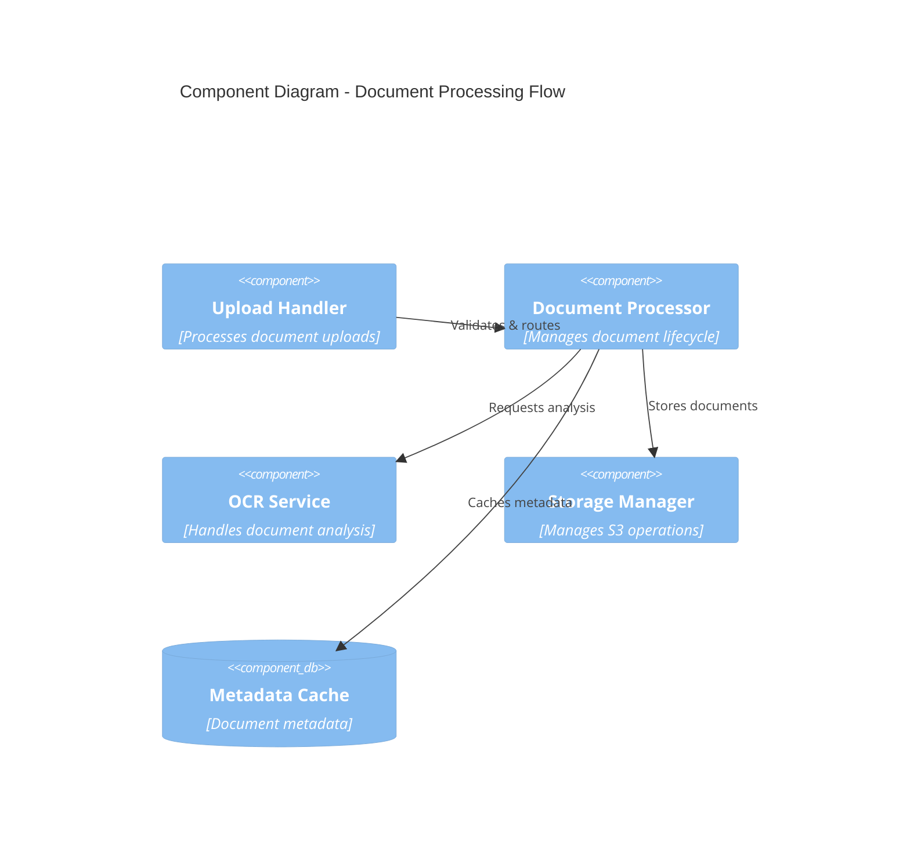
```mermaid
C4Component
    title Component Diagram - Document Processing Flow

    Component(upload_handler, "Upload Handler", "Processes document uploads")
    Component(doc_processor, "Document Processor", "Manages document lifecycle")
    Component(ocr_service, "OCR Service", "Handles document analysis")
    Component(storage_mgr, "Storage Manager", "Manages S3 operations")
    
    ComponentDb(meta_cache, "Metadata Cache", "Document metadata")
    
    Rel(upload_handler, doc_processor, "Validates & routes")
    Rel(doc_processor, ocr_service, "Requests analysis")
    Rel(doc_processor, storage_mgr, "Stores documents")
    Rel(doc_processor, meta_cache, "Caches metadata")
```

## 2.3 Technical Decisions

### 2.3.1 Data Flow Architecture

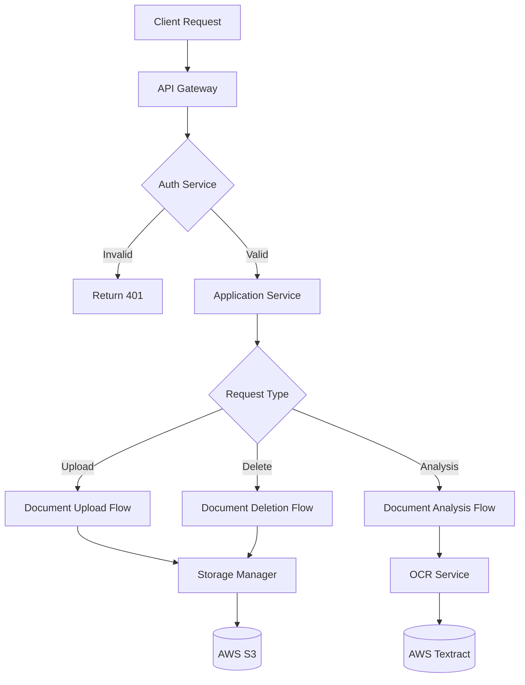
```mermaid
flowchart TD
    A[Client Request] --> B[API Gateway]
    B --> C{Auth Service}
    C -->|Invalid| D[Return 401]
    C -->|Valid| E[Application Service]
    
    E --> F{Request Type}
    F -->|Upload| G[Document Upload Flow]
    F -->|Analysis| H[Document Analysis Flow]
    F -->|Delete| I[Document Deletion Flow]
    
    G --> J[Storage Manager]
    H --> K[OCR Service]
    I --> J
    
    J --> L[(AWS S3)]
    K --> M[(AWS Textract)]
```

### 2.3.2 Deployment Architecture

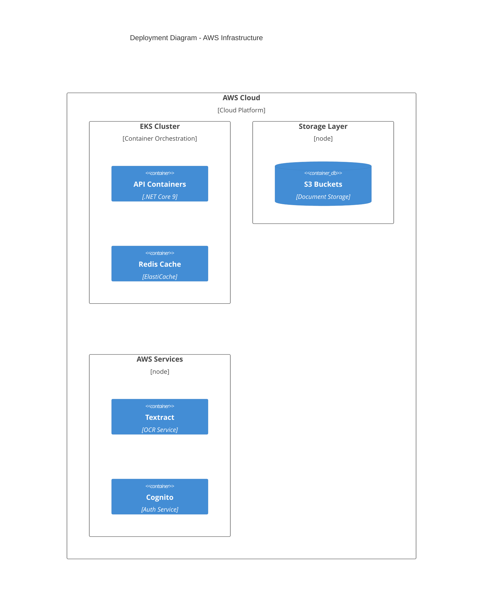
```mermaid
C4Deployment
    title Deployment Diagram - AWS Infrastructure

    Deployment_Node(aws, "AWS Cloud", "Cloud Platform"){
        Deployment_Node(eks, "EKS Cluster", "Container Orchestration"){
            Container(api, "API Containers", ".NET Core 9")
            Container(cache, "Redis Cache", "ElastiCache")
        }
        
        Deployment_Node(storage, "Storage Layer"){
            ContainerDb(s3, "S3 Buckets", "Document Storage")
        }
        
        Deployment_Node(services, "AWS Services"){
            Container(textract, "Textract", "OCR Service")
            Container(cognito, "Cognito", "Auth Service")
        }
    }
```

## 2.4 Cross-Cutting Concerns

### 2.4.1 Monitoring and Observability

| Component | Monitoring Approach | Metrics |
| --- | --- | --- |
| API Performance | CloudWatch Metrics | Response times, error rates |
| Document Processing | Custom metrics | Processing duration, success rate |
| Storage Operations | S3 metrics | Upload/download speeds, storage usage |
| Authentication | Cognito logs | Auth success/failure rates |

### 2.4.2 Security Architecture

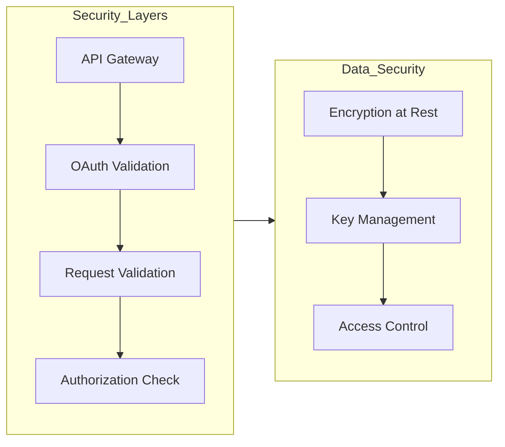
```mermaid
flowchart LR
    subgraph Security_Layers
        direction TB
        A[API Gateway] --> B[OAuth Validation]
        B --> C[Request Validation]
        C --> D[Authorization Check]
    end
    
    subgraph Data_Security
        direction TB
        E[Encryption at Rest] --> F[Key Management]
        F --> G[Access Control]
    end
    
    Security_Layers --> Data_Security
```

### 2.4.3 Error Handling Strategy

| Error Type | Handling Approach | Recovery Method |
| --- | --- | --- |
| Authentication | Token refresh/redirect | Automatic retry |
| Storage | Circuit breaker pattern | Fallback to secondary region |
| Processing | Queue-based retry | Exponential backoff |
| System | Graceful degradation | Auto-scaling trigger |

### 2.4.4 Disaster Recovery

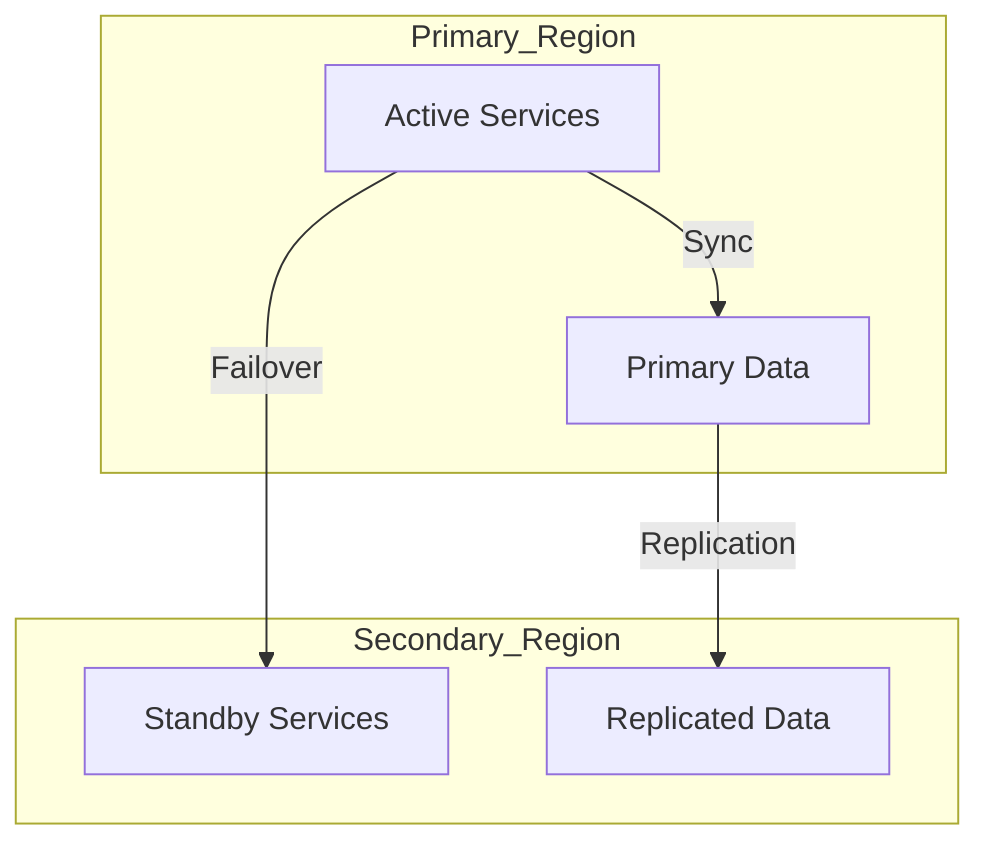
```mermaid
flowchart TD
    subgraph Primary_Region
        A[Active Services]
        B[Primary Data]
    end
    
    subgraph Secondary_Region
        C[Standby Services]
        D[Replicated Data]
    end
    
    A -->|Sync| B
    B -->|Replication| D
    A -->|Failover| C
```

# 3. SYSTEM COMPONENTS ARCHITECTURE

## 3.1 API DESIGN

### 3.1.1 API Architecture

| Component | Specification |
| --- | --- |
| Protocol | HTTPS/REST |
| Authentication | OAuth 2.0 via AWS Cognito |
| Rate Limiting | 1000 requests/minute per client |
| Versioning | URI-based (/v1/, /v2/) |
| Documentation | OpenAPI 3.0 Specification |
| Content Type | application/json |

### 3.1.2 Endpoint Specifications

```mermaid
classDiagram
    class DocumentEndpoints {
        POST /v1/documents/upload
        DELETE /v1/documents/{id}
        POST /v1/documents/analyze
        GET /v1/documents/{id}/status
        GET /v1/documents/{id}/metadata
    }
    
    class RequestFormat {
        user_id: int
        document_name: string
        document: byte[]
        document_type: int
        document_type_name: string
        document_url: string?
    }
    
    class ResponseFormat {
        status: string
        message: string
        data: object
        errors: array?
    }
```

### 3.1.3 Integration Architecture

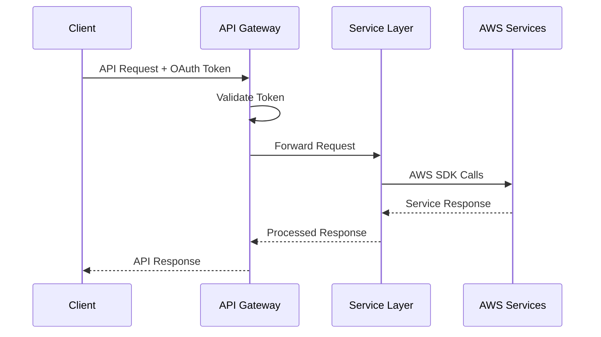
```mermaid
sequenceDiagram
    participant C as Client
    participant A as API Gateway
    participant S as Service Layer
    participant AWS as AWS Services
    
    C->>A: API Request + OAuth Token
    A->>A: Validate Token
    A->>S: Forward Request
    S->>AWS: AWS SDK Calls
    AWS-->>S: Service Response
    S-->>A: Processed Response
    A-->>C: API Response
```

## 3.2 DATABASE DESIGN

### 3.2.1 Document Storage Schema

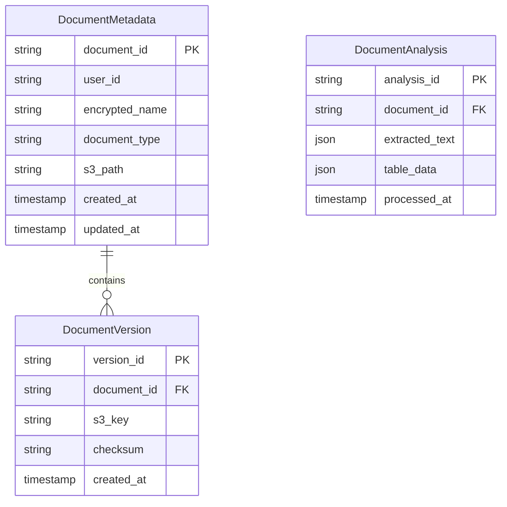
```mermaid
erDiagram
    DocumentMetadata ||--o{ DocumentVersion : contains
    DocumentMetadata {
        string document_id PK
        string user_id
        string encrypted_name
        string document_type
        string s3_path
        timestamp created_at
        timestamp updated_at
    }
    DocumentVersion {
        string version_id PK
        string document_id FK
        string s3_key
        string checksum
        timestamp created_at
    }
    DocumentAnalysis {
        string analysis_id PK
        string document_id FK
        json extracted_text
        json table_data
        timestamp processed_at
    }
```

### 3.2.2 Storage Management

| Aspect | Implementation |
| --- | --- |
| Primary Storage | AWS S3 with AES-256 encryption |
| Metadata Storage | DynamoDB for document metadata |
| Cache Layer | Redis for analysis results |
| Backup Strategy | Cross-region replication |
| Retention Policy | 7-year retention for compliance |
| Archive Strategy | S3 Glacier after 90 days |

### 3.2.3 Performance Optimization

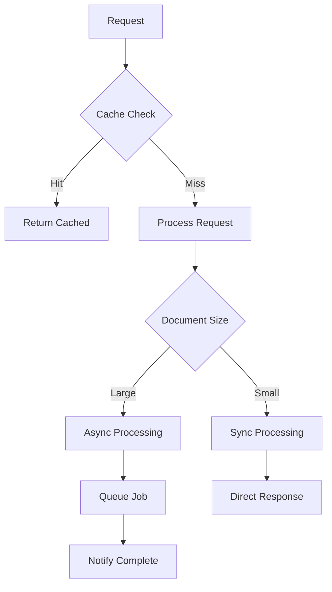
```mermaid
flowchart TD
    A[Request] --> B{Cache Check}
    B -->|Hit| C[Return Cached]
    B -->|Miss| D[Process Request]
    D --> E{Document Size}
    E -->|Large| F[Async Processing]
    E -->|Small| G[Sync Processing]
    F --> H[Queue Job]
    G --> I[Direct Response]
    H --> J[Notify Complete]
```

## 3.3 SECURITY ARCHITECTURE

### 3.3.1 Authentication Flow

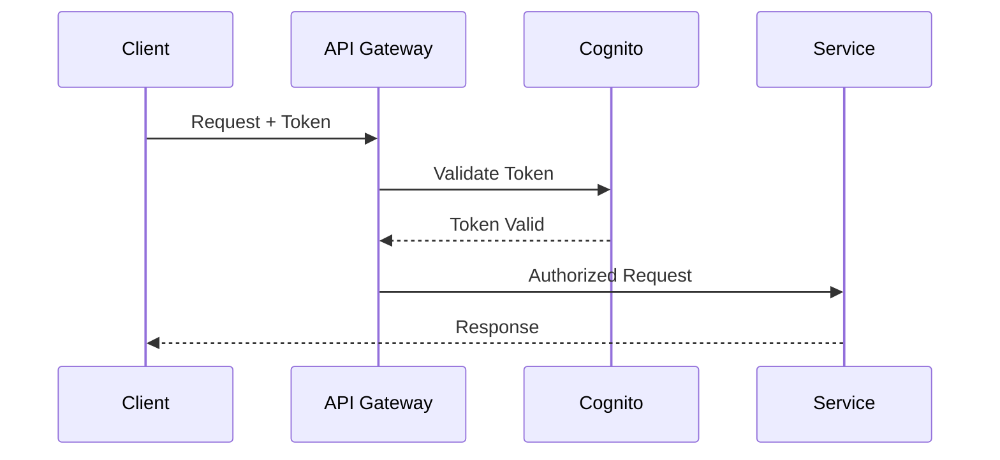
```mermaid
sequenceDiagram
    participant C as Client
    participant AG as API Gateway
    participant CO as Cognito
    participant S as Service
    
    C->>AG: Request + Token
    AG->>CO: Validate Token
    CO-->>AG: Token Valid
    AG->>S: Authorized Request
    S-->>C: Response
```

### 3.3.2 Security Controls

| Control Type | Implementation |
| --- | --- |
| Transport Security | TLS 1.3 |
| Data Encryption | AES-256 at rest |
| Key Management | AWS KMS |
| Access Control | IAM + RBAC |
| Input Validation | Request schema validation |
| Output Encoding | JSON encoding |

### 3.3.3 Document Security

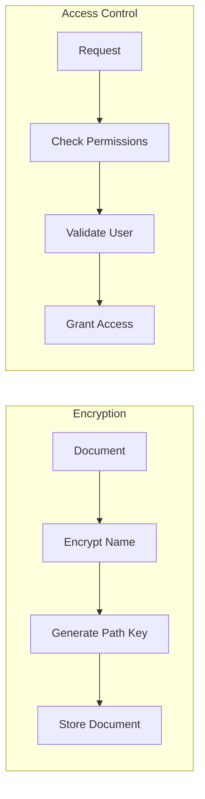
```mermaid
flowchart LR
    subgraph Encryption
        A[Document] --> B[Encrypt Name]
        B --> C[Generate Path Key]
        C --> D[Store Document]
    end
    
    subgraph Access Control
        E[Request] --> F[Check Permissions]
        F --> G[Validate User]
        G --> H[Grant Access]
    end
```

## 3.4 MONITORING AND OBSERVABILITY

### 3.4.1 Logging Architecture

| Component | Implementation |
| --- | --- |
| Application Logs | CloudWatch Logs |
| Metrics | CloudWatch Metrics |
| Tracing | AWS X-Ray |
| Alerts | CloudWatch Alarms |
| Dashboards | CloudWatch Dashboards |

### 3.4.2 Health Checks

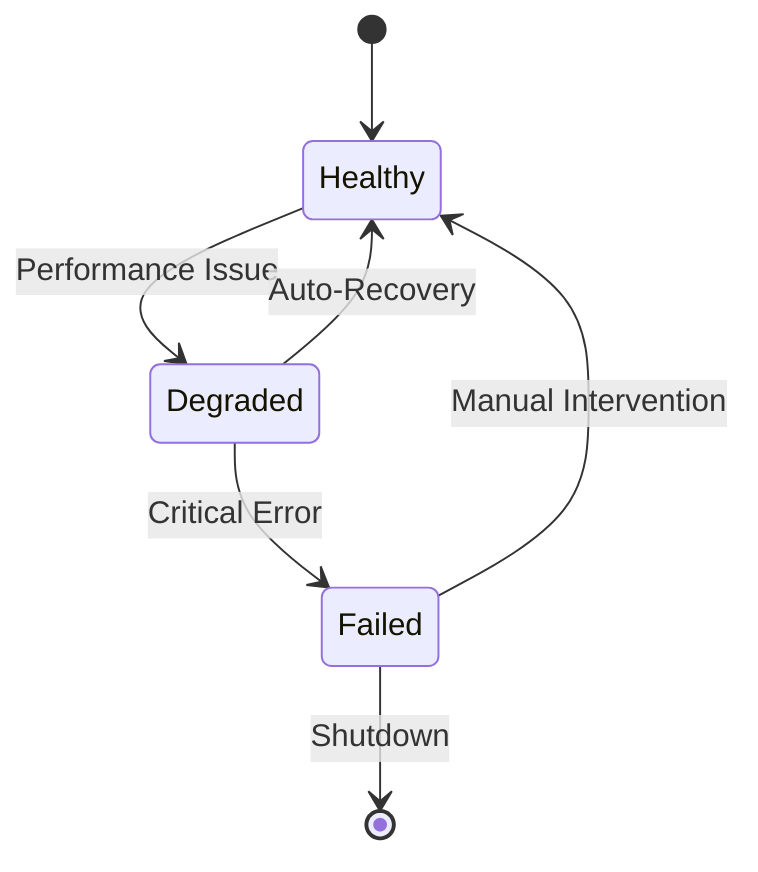
```mermaid
stateDiagram-v2
    [*] --> Healthy
    Healthy --> Degraded: Performance Issue
    Degraded --> Healthy: Auto-Recovery
    Degraded --> Failed: Critical Error
    Failed --> Healthy: Manual Intervention
    Failed --> [*]: Shutdown
```

### 3.4.3 Performance Metrics

| Metric | Target | Alert Threshold |
| --- | --- | --- |
| API Latency | \< 300ms | \> 1000ms |
| Error Rate | \< 0.1% | \> 1% |
| CPU Usage | \< 70% | \> 85% |
| Memory Usage | \< 80% | \> 90% |
| Storage Usage | \< 75% | \> 90% |

# 4. TECHNOLOGY STACK

## 4.1 PROGRAMMING LANGUAGES

| Platform/Component | Language | Version | Justification |
| --- | --- | --- | --- |
| API Service | C# | .NET Core 9 | Required by specification, strong type safety, excellent AWS SDK support |
| Infrastructure Scripts | TypeScript | 5.0+ | Type-safe infrastructure as code, AWS CDK compatibility |
| Build Scripts | PowerShell Core | 7.0+ | Cross-platform compatibility, native AWS tooling support |

## 4.2 FRAMEWORKS & LIBRARIES

### Core Frameworks

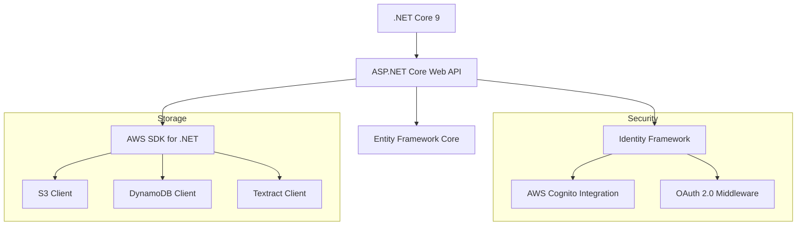
```mermaid
graph TD
    A[.NET Core 9] --> B[ASP.NET Core Web API]
    B --> C[AWS SDK for .NET]
    B --> D[Entity Framework Core]
    B --> E[Identity Framework]
    
    subgraph Security
        E --> F[AWS Cognito Integration]
        E --> G[OAuth 2.0 Middleware]
    end
    
    subgraph Storage
        C --> H[S3 Client]
        C --> I[DynamoDB Client]
        C --> J[Textract Client]
    end
```

| Framework | Version | Purpose | Justification |
| --- | --- | --- | --- |
| ASP.NET Core Web API | 9.0 | API Framework | Required by spec, excellent performance, AWS integration |
| AWS SDK for .NET | Latest | AWS Services Integration | Official SDK, comprehensive AWS service support |
| StackExchange.Redis | 2.6+ | Caching Layer | Industry standard, high performance |
| Serilog | 3.0+ | Structured Logging | CloudWatch integration, structured logging support |

## 4.3 DATABASES & STORAGE

### Storage Architecture

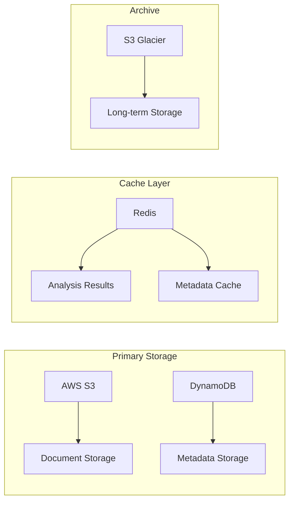
```mermaid
flowchart LR
    subgraph Primary Storage
        A[AWS S3] --> B[Document Storage]
        C[DynamoDB] --> D[Metadata Storage]
    end
    
    subgraph Cache Layer
        E[Redis] --> F[Analysis Results]
        E --> G[Metadata Cache]
    end
    
    subgraph Archive
        H[S3 Glacier] --> I[Long-term Storage]
    end
```

| Component | Technology | Purpose |
| --- | --- | --- |
| Document Storage | AWS S3 | Primary document repository with AES-256 encryption |
| Metadata Storage | DynamoDB | Document metadata, fast lookups |
| Cache Layer | Redis | Analysis results, temporary data |
| Archive Storage | S3 Glacier | Long-term document archival |

## 4.4 THIRD-PARTY SERVICES

| Service | Purpose | Integration Method |
| --- | --- | --- |
| AWS Cognito | OAuth Authentication | AWS SDK |
| AWS Textract | Document Analysis | AWS SDK |
| AWS CloudWatch | Monitoring & Logging | AWS SDK |
| AWS KMS | Key Management | AWS SDK |
| AWS X-Ray | Distributed Tracing | SDK Integration |

### Service Dependencies

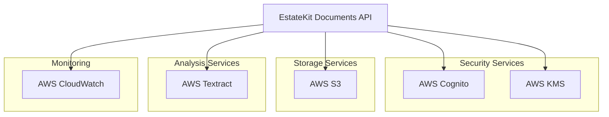
```mermaid
graph TD
    A[EstateKit Documents API] --> B[AWS Cognito]
    A --> C[AWS S3]
    A --> D[AWS Textract]
    A --> E[AWS CloudWatch]
    A --> F[AWS KMS]
    
    subgraph Security Services
        B
        F
    end
    
    subgraph Storage Services
        C
    end
    
    subgraph Analysis Services
        D
    end
    
    subgraph Monitoring
        E
    end
```

## 4.5 DEVELOPMENT & DEPLOYMENT

### Development Tools

| Tool | Purpose | Version |
| --- | --- | --- |
| Visual Studio | Primary IDE | 2024+ |
| Docker Desktop | Local Containerization | Latest |
| AWS CLI | Cloud Management | v2+ |
| Postman | API Testing | Latest |

### Deployment Pipeline

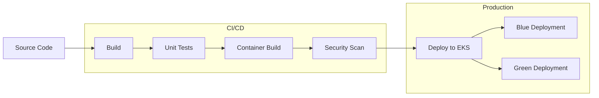
```mermaid
flowchart LR
    A[Source Code] --> B[Build]
    B --> C[Unit Tests]
    C --> D[Container Build]
    D --> E[Security Scan]
    E --> F[Deploy to EKS]
    
    subgraph CI/CD
        B
        C
        D
        E
    end
    
    subgraph Production
        F --> G[Blue Deployment]
        F --> H[Green Deployment]
    end
```

| Stage | Technology | Purpose |
| --- | --- | --- |
| Source Control | Git | Version control |
| CI/CD | AWS CodePipeline | Automated deployment |
| Containerization | Docker | Application packaging |
| Container Orchestration | AWS EKS | Production deployment |
| Infrastructure as Code | AWS CDK | Infrastructure management |

# 5. SYSTEM DESIGN

## 5.1 SYSTEM ARCHITECTURE OVERVIEW

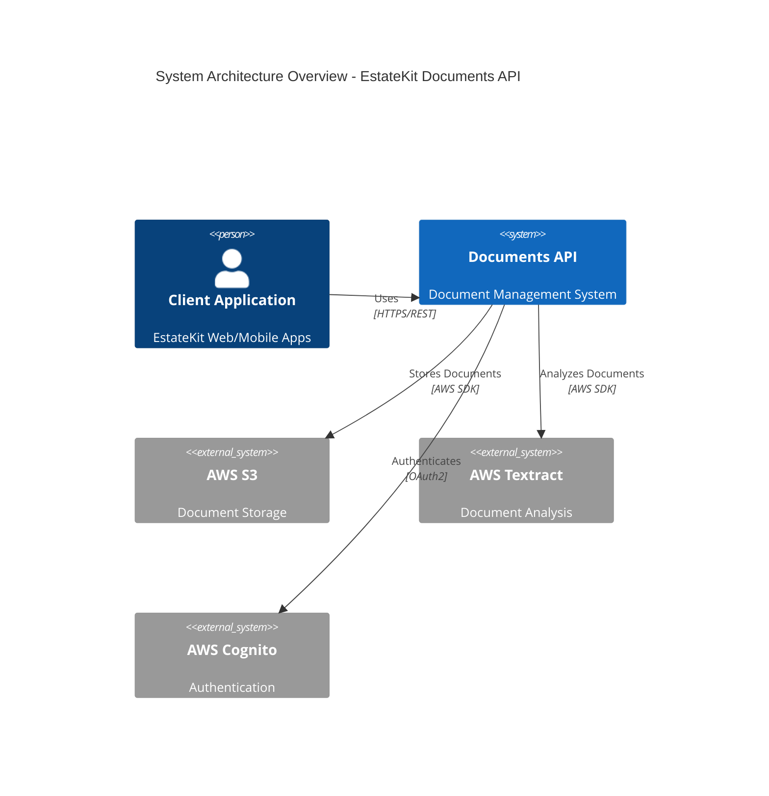
```mermaid
C4Context
    title System Architecture Overview - EstateKit Documents API

    Person(client, "Client Application", "EstateKit Web/Mobile Apps")
    System(api, "Documents API", "Document Management System")
    
    System_Ext(s3, "AWS S3", "Document Storage")
    System_Ext(textract, "AWS Textract", "Document Analysis")
    System_Ext(cognito, "AWS Cognito", "Authentication")
    
    Rel(client, api, "Uses", "HTTPS/REST")
    Rel(api, s3, "Stores Documents", "AWS SDK")
    Rel(api, textract, "Analyzes Documents", "AWS SDK")
    Rel(api, cognito, "Authenticates", "OAuth2")
```

## 5.2 API DESIGN

### 5.2.1 REST Endpoints

| Endpoint | Method | Purpose | Request Format | Response Format |
| --- | --- | --- | --- | --- |
| /v1/documents/upload | POST | Upload document | Multipart/form-data | JSON |
| /v1/documents/{id} | DELETE | Delete document | JSON | JSON |
| /v1/documents/analyze | POST | Analyze document | JSON/Multipart | JSON |
| /v1/documents/{id}/status | GET | Check document status | - | JSON |

### 5.2.2 Request/Response Flow

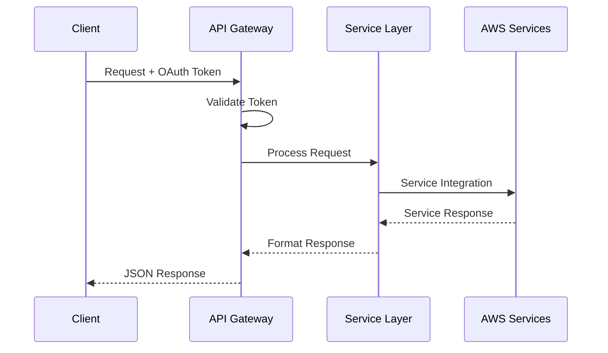
```mermaid
sequenceDiagram
    participant C as Client
    participant A as API Gateway
    participant S as Service Layer
    participant AWS as AWS Services
    
    C->>A: Request + OAuth Token
    A->>A: Validate Token
    A->>S: Process Request
    S->>AWS: Service Integration
    AWS-->>S: Service Response
    S-->>A: Format Response
    A-->>C: JSON Response
```

## 5.3 DATABASE DESIGN

### 5.3.1 Document Storage Schema

```mermaid
erDiagram
    Document ||--o{ Version : contains
    Document {
        string id PK
        string userId
        string encryptedName
        string documentType
        string s3Path
        timestamp createdAt
    }
    Version {
        string versionId PK
        string documentId FK
        string s3Key
        timestamp createdAt
    }
    Analysis {
        string analysisId PK
        string documentId FK
        json extractedData
        timestamp analyzedAt
    }
```

### 5.3.2 Storage Organization

| Storage Type | Implementation | Purpose |
| --- | --- | --- |
| Document Files | AWS S3 | Raw document storage |
| Metadata | DynamoDB | Document information |
| Analysis Results | Redis Cache | Temporary analysis data |
| Audit Logs | CloudWatch | System monitoring |

## 5.4 SECURITY DESIGN

### 5.4.1 Authentication Flow

```mermaid
flowchart TD
    A[Client Request] --> B{Valid OAuth?}
    B -->|No| C[Return 401]
    B -->|Yes| D[Validate Permissions]
    D -->|Invalid| E[Return 403]
    D -->|Valid| F[Process Request]
    F --> G[Return Response]
```

### 5.4.2 Encryption Strategy

| Layer | Method | Implementation |
| --- | --- | --- |
| Transport | TLS 1.3 | HTTPS |
| Storage | AES-256 | S3 Server-Side |
| Document Names | AES | Custom Encryption |
| Access Keys | KMS | AWS Key Management |

## 5.5 SCALABILITY DESIGN

### 5.5.1 Infrastructure Architecture

```mermaid
flowchart LR
    subgraph Load Balancer
        ALB[Application Load Balancer]
    end
    
    subgraph EKS Cluster
        P1[Pod 1]
        P2[Pod 2]
        P3[Pod N]
    end
    
    subgraph Storage
        S1[S3 Primary]
        S2[S3 Replica]
    end
    
    ALB --> P1
    ALB --> P2
    ALB --> P3
    
    P1 --> S1
    P2 --> S1
    P3 --> S1
    
    S1 --> S2
```

### 5.5.2 Performance Optimization

| Component | Strategy | Implementation |
| --- | --- | --- |
| API Caching | Redis | Analysis results |
| Load Distribution | EKS | Auto-scaling |
| Storage Performance | S3 | Multi-region |
| Request Handling | Async | Task queuing |

## 5.6 MONITORING DESIGN

### 5.6.1 Logging Architecture

```mermaid
flowchart LR
    subgraph API
        A[Application Logs]
        B[Performance Metrics]
        C[Audit Logs]
    end
    
    subgraph CloudWatch
        D[Log Groups]
        E[Metrics]
        F[Alarms]
    end
    
    A --> D
    B --> E
    C --> D
    E --> F
```

### 5.6.2 Monitoring Metrics

| Metric Type | Source | Threshold | Alert |
| --- | --- | --- | --- |
| API Latency | Application | \> 3s | High |
| Error Rate | CloudWatch | \> 1% | Critical |
| Storage Usage | S3 | \> 80% | Medium |
| CPU Usage | EKS | \> 70% | Medium |

# 6. USER INTERFACE DESIGN

No user interface required. This is a backend API service that provides document management capabilities through REST endpoints only. All interactions are handled programmatically through API calls. For frontend interface requirements, please refer to the consuming applications' specifications.

Note: The EstateKit Documents API is designed as a headless service focused on document processing, storage, and analysis functionality. User interface components are implemented by the consuming EstateKit applications and web services that integrate with this API.

# 7. SECURITY CONSIDERATIONS

## 7.1 AUTHENTICATION AND AUTHORIZATION

### 7.1.1 Authentication Flow

```mermaid
sequenceDiagram
    participant Client
    participant API
    participant Cognito
    participant Services
    
    Client->>API: Request + OAuth Token
    API->>Cognito: Validate Token
    Cognito-->>API: Token Status
    alt Invalid Token
        API-->>Client: 401 Unauthorized
    else Valid Token
        API->>Services: Authorized Request
        Services-->>API: Response
        API-->>Client: 200 OK + Data
    end
```

### 7.1.2 Authorization Matrix

| Role | Document Upload | Document Delete | Document Analysis | Archive Access |
| --- | --- | --- | --- | --- |
| Admin | ✓ | ✓ | ✓ | ✓ |
| Service Account | ✓ | ✓ | ✓ | ✗ |
| Read-Only | ✗ | ✗ | ✓ | ✗ |

### 7.1.3 Token Management

| Aspect | Implementation |
| --- | --- |
| Token Type | JWT (JSON Web Token) |
| Token Lifetime | 1 hour |
| Refresh Token | 24 hours |
| Signature Algorithm | RS256 |
| Token Storage | Client-side secure storage |

## 7.2 DATA SECURITY

### 7.2.1 Encryption Strategy

```mermaid
flowchart TD
    A[Document] --> B{Encryption Layer}
    B --> C[Transport Security]
    B --> D[Storage Security]
    B --> E[Field Security]
    
    C --> F[TLS 1.3]
    D --> G[AES-256]
    E --> H[Field-level Encryption]
    
    G --> I[AWS KMS]
    H --> J[Document Path]
    H --> K[File Names]
```

### 7.2.2 Data Protection Measures

| Layer | Protection Method | Implementation |
| --- | --- | --- |
| Transport | TLS 1.3 | HTTPS with perfect forward secrecy |
| Storage | AES-256 | S3 server-side encryption |
| Database | Transparent Data Encryption | DynamoDB encryption |
| Application | Field-level Encryption | Custom encryption for sensitive fields |
| Keys | Key Rotation | AWS KMS automatic rotation |

### 7.2.3 Data Classification

| Data Type | Classification | Protection Level |
| --- | --- | --- |
| Document Content | Confidential | Full Encryption |
| Document Metadata | Internal | Encrypted at Rest |
| Analysis Results | Sensitive | Temporary Cache + Encryption |
| Audit Logs | Internal | Encrypted + WORM Storage |

## 7.3 SECURITY PROTOCOLS

### 7.3.1 Security Controls

```mermaid
flowchart LR
    subgraph Prevention
        A[Input Validation]
        B[Access Control]
        C[Rate Limiting]
    end
    
    subgraph Detection
        D[Audit Logging]
        E[Threat Monitoring]
        F[Anomaly Detection]
    end
    
    subgraph Response
        G[Incident Response]
        H[Auto-remediation]
        I[Security Alerts]
    end
    
    Prevention --> Detection
    Detection --> Response
```

### 7.3.2 Security Standards Compliance

| Standard | Implementation | Verification |
| --- | --- | --- |
| OWASP Top 10 | Security controls and code review | Automated security scanning |
| SOC 2 Type II | Process documentation and controls | Annual audit |
| GDPR | Data protection measures | Regular assessment |
| HIPAA | PHI handling procedures | Compliance review |

### 7.3.3 Security Monitoring

| Component | Monitoring Method | Alert Threshold |
| --- | --- | --- |
| API Gateway | Request pattern analysis | \>100 errors/minute |
| Authentication | Failed login attempts | \>10 failures/minute |
| Document Access | Access pattern monitoring | Unusual access patterns |
| Infrastructure | AWS GuardDuty | High severity findings |

### 7.3.4 Incident Response

```mermaid
stateDiagram-v2
    [*] --> Detection
    Detection --> Analysis
    Analysis --> Containment
    Containment --> Eradication
    Eradication --> Recovery
    Recovery --> PostIncident
    PostIncident --> [*]
    
    Analysis --> Escalation
    Escalation --> Containment
```

### 7.3.5 Security Testing

| Test Type | Frequency | Tools |
| --- | --- | --- |
| Penetration Testing | Quarterly | AWS Inspector, Custom Tools |
| Vulnerability Scanning | Weekly | OWASP ZAP, SonarQube |
| Security Review | Monthly | Manual Code Review |
| Compliance Audit | Annually | Third-party Auditor |

# 8. INFRASTRUCTURE

## 8.1 DEPLOYMENT ENVIRONMENT

The EstateKit Documents API is deployed exclusively on AWS cloud infrastructure to leverage its comprehensive security features and document processing services.

| Environment | Purpose | Configuration |
| --- | --- | --- |
| Development | Feature development and testing | Single AZ, t3.medium instances |
| Staging | Integration testing and UAT | Multi-AZ, t3.large instances |
| Production | Live system operation | Multi-AZ, t3.xlarge instances with auto-scaling |

### Infrastructure Architecture

```mermaid
graph TD
    subgraph AWS Cloud
        subgraph "Region Primary"
            ALB[Application Load Balancer]
            subgraph "AZ 1"
                EKS1[EKS Node Group 1]
            end
            subgraph "AZ 2"
                EKS2[EKS Node Group 2]
            end
            S3P[S3 Primary]
        end
        
        subgraph "Region Secondary"
            S3S[S3 Secondary]
            EKSS[EKS Standby]
        end
    end
    
    ALB --> EKS1
    ALB --> EKS2
    S3P --> S3S
```

## 8.2 CLOUD SERVICES

| Service | Purpose | Configuration |
| --- | --- | --- |
| AWS EKS | Container orchestration | Version 1.27+, managed node groups |
| AWS S3 | Document storage | Standard tier with cross-region replication |
| AWS Textract | Document analysis | Asynchronous processing mode |
| AWS Cognito | Authentication | OAuth 2.0 with custom user pool |
| AWS CloudWatch | Monitoring and logging | Enhanced monitoring enabled |
| AWS KMS | Key management | Customer managed keys (CMK) |

### Service Integration Architecture

```mermaid
flowchart LR
    subgraph Core Services
        A[EKS Cluster] --> B[Application Load Balancer]
        B --> C[API Containers]
    end
    
    subgraph AWS Services
        C --> D[Cognito]
        C --> E[S3]
        C --> F[Textract]
        C --> G[CloudWatch]
        C --> H[KMS]
    end
```

## 8.3 CONTAINERIZATION

### Container Strategy

| Component | Base Image | Size | Configuration |
| --- | --- | --- | --- |
| API Service | mcr.microsoft.com/dotnet/aspnet:9.0 | \< 200MB | Multi-stage build |
| Redis Cache | redis:alpine | \< 100MB | Persistence enabled |
| Monitoring | grafana/grafana | \< 200MB | Custom dashboards |

### Container Configuration

```mermaid
graph TD
    subgraph Container Architecture
        A[API Container] --> B[Config Volume]
        A --> C[Secrets Volume]
        D[Redis Container] --> E[Data Volume]
        F[Monitoring Container] --> G[Dashboard Volume]
    end
```

## 8.4 ORCHESTRATION

### EKS Configuration

| Component | Specification | Scaling Policy |
| --- | --- | --- |
| Node Groups | t3.xlarge | 2-10 nodes |
| Pods per Node | Maximum 30 | HPA enabled |
| Control Plane | AWS managed | Multi-AZ |
| Networking | AWS VPC CNI | Calico network policy |

### Kubernetes Resources

```mermaid
flowchart TD
    subgraph Kubernetes Resources
        A[Ingress] --> B[Service]
        B --> C[Deployment]
        C --> D[ReplicaSet]
        D --> E[Pods]
        F[ConfigMap] --> E
        G[Secrets] --> E
    end
```

## 8.5 CI/CD PIPELINE

### Pipeline Architecture

```mermaid
flowchart LR
    A[Source Code] --> B[Build]
    B --> C[Unit Tests]
    C --> D[Container Build]
    D --> E[Security Scan]
    E --> F[Deploy to Dev]
    F --> G[Integration Tests]
    G --> H[Deploy to Staging]
    H --> I[UAT]
    I --> J[Deploy to Prod]
```

### Deployment Configuration

| Stage | Tool | Configuration |
| --- | --- | --- |
| Source Control | Git | Feature branch workflow |
| Build | AWS CodeBuild | Multi-stage Dockerfile |
| Testing | xUnit + SonarQube | 80% coverage minimum |
| Security | Snyk + OWASP ZAP | Critical issues blocking |
| Deployment | AWS CodeDeploy | Blue-green deployment |
| Monitoring | CloudWatch | Custom metrics and alerts |

### Deployment Strategy

| Environment | Strategy | Rollback Time |
| --- | --- | --- |
| Development | Direct deployment | \< 5 minutes |
| Staging | Blue-green | \< 10 minutes |
| Production | Blue-green | \< 15 minutes |

# 8. APPENDICES

## 8.1 ADDITIONAL TECHNICAL INFORMATION

### Document Type Mapping

| Type ID | Document Category | Allowed Extensions | Storage Path Pattern |
| --- | --- | --- | --- |
| 1 | Password Files | .pdf, .doc, .docx, .jpg, .png, .gif, .txt, xlsx | /passwords/{encrypted_user_id}/{encrypted_filename} |
| 2 | Medical.pdf, .doc, .docx, .jpg, .png, .gif, .txt, xlsx | /medical/{encrypted_user_id}/{encrypted_filename} |
| 3 | Insurance | .pdf, .doc, .docx, .jpg, .png, .gif, .txt, xlsx | /insurance/{encrypted_user_id}/{encrypted_filename} |
| 4 | Personal Identifiers | .pdf, .doc, .docx, .jpg, .png, .gif, .txt, xlsx | /personal/{encrypted_user_id}/{encrypted_filename} |

### Environment Variable Configuration

```mermaid
graph TD
    A[Environment Variables] --> B[AWS Credentials]
    A --> C[Service Configuration]
    A --> D[Security Settings]
    
    B --> B1[S3 Access Keys]
    B --> B2[Textract Credentials]
    B --> B3[Cognito Client Config]
    
    C --> C1[API Settings]
    C --> C2[Storage Settings]
    C --> C3[Processing Settings]
    
    D --> D1[Encryption Keys]
    D --> D2[Security Policies]
    D --> D3[Compliance Settings]
```

## 8.2 GLOSSARY

| Term | Definition |
| --- | --- |
| Document Path Key | Encrypted identifier combining user ID and document type for S3 storage organization |
| Estate Kit | Parent application ecosystem consuming the Documents API services |
| Document Analysis | Process of extracting text, tables and metadata from documents using OCR |
| Name-Value Pair | Data structure containing an identified field and its corresponding value |
| Document Lifecycle | Complete process of document upload, storage, analysis, and archival |
| Blue-Green Deployment | Deployment strategy using two identical environments for zero-downtime updates |
| Circuit Breaker | Design pattern preventing cascade failures in distributed systems |
| Cross-Region Replication | Automatic copying of S3 objects across AWS regions for redundancy |

## 8.3 ACRONYMS

| Acronym | Full Form |
| --- | --- |
| API | Application Programming Interface |
| AWS | Amazon Web Services |
| EKS | Elastic Kubernetes Service |
| IAM | Identity and Access Management |
| JSON | JavaScript Object Notation |
| JWT | JSON Web Token |
| KMS | Key Management Service |
| OCR | Optical Character Recognition |
| OAuth | Open Authorization |
| REST | Representational State Transfer |
| S3 | Simple Storage Service |
| SDK | Software Development Kit |
| TLS | Transport Layer Security |
| VPC | Virtual Private Cloud |
| RBAC | Role-Based Access Control |
| AES | Advanced Encryption Standard |
| WORM | Write Once Read Many |
| CSV | Comma-Separated Values |

## 8.4 REFERENCE ARCHITECTURE

```mermaid
C4Context
    title Reference Architecture - EstateKit Documents API

    Person(client, "Client Application", "EstateKit Web/Mobile Apps")
    System(api, "Documents API", "Document Management System")
    
    System_Ext(cognito, "AWS Cognito", "Authentication")
    System_Ext(s3, "AWS S3", "Storage")
    System_Ext(textract, "AWS Textract", "Analysis")
    System_Ext(kms, "AWS KMS", "Key Management")
    
    Rel(client, api, "Uses", "HTTPS/REST")
    Rel(api, cognito, "Authenticates", "OAuth2")
    Rel(api, s3, "Stores", "AWS SDK")
    Rel(api, textract, "Analyzes", "AWS SDK")
    Rel(api, kms, "Encrypts", "AWS SDK")
```