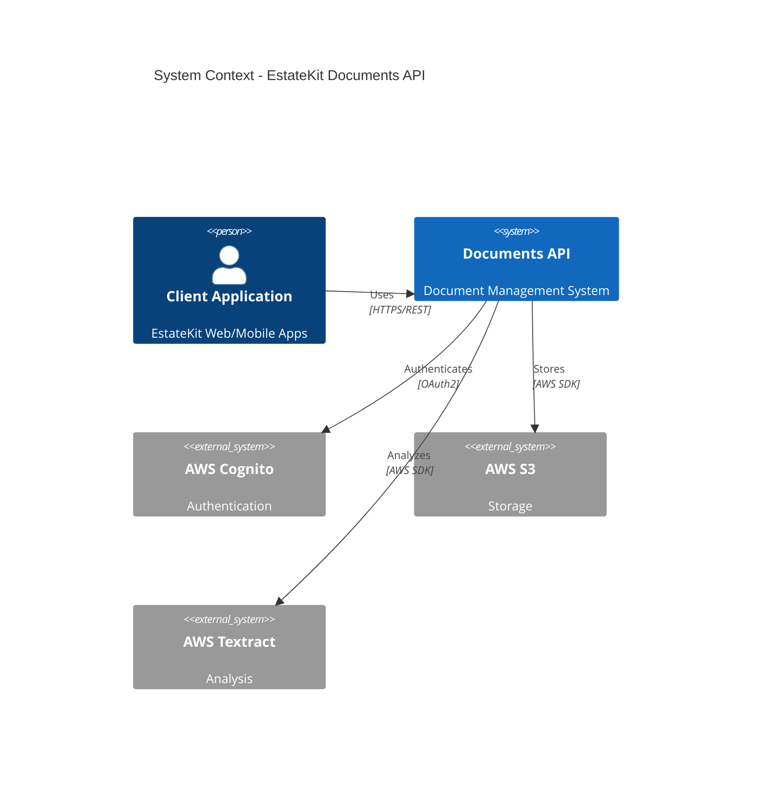
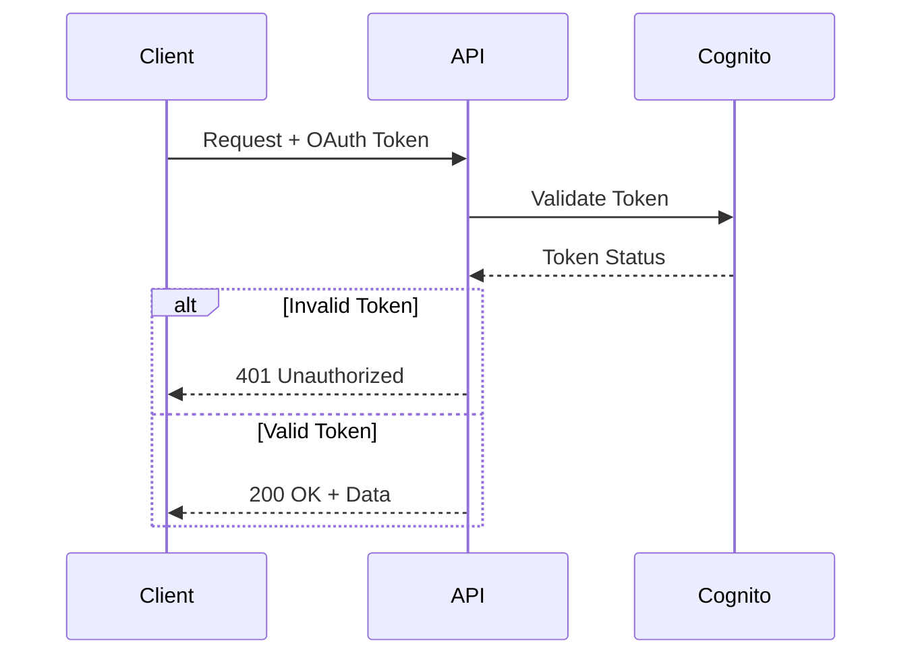

# EstateKit Documents API

## Overview

The EstateKit Documents API is a secure document management system that provides encrypted storage, analysis, and lifecycle management capabilities for the EstateKit application ecosystem. Built on AWS infrastructure, it offers enterprise-grade security, scalability, and compliance features.

### Key Features

- Secure document storage with AES-256 encryption
- Automated document analysis using AWS Textract
- OAuth2 authentication via AWS Cognito
- Comprehensive document lifecycle management
- Financial regulatory compliance
- Multi-region high availability

### Architecture Overview



## Prerequisites

### Required Software

- .NET Core 9.0 SDK (9.0.0 or higher)
- Docker Desktop (Latest)
- AWS CLI v2+
- Visual Studio 2024+ or VS Code (Latest)
- Git (Latest)

### AWS Account Requirements

- IAM user with appropriate permissions
- S3 bucket access
- Cognito user pool
- Textract service access
- CloudWatch access

## Getting Started

### Local Development Setup

1. Clone the repository:
```bash
git clone https://github.com/estatekit/documents-api.git
cd documents-api
```

2. Configure AWS credentials:
```bash
aws configure
```

3. Set up environment variables:
```bash
cp .env.example .env
# Edit .env with your configuration
```

4. Install dependencies:
```bash
dotnet restore
```

5. Run the application:
```bash
dotnet run --project src/EstateKit.Documents.Api
```

### Docker Environment

1. Build the containers:
```bash
docker-compose build
```

2. Start the services:
```bash
docker-compose up -d
```

3. Verify the deployment:
```bash
docker-compose ps
```

### Configuration

#### appsettings.json Structure
```json
{
  "AWS": {
    "Region": "us-west-2",
    "S3": {
      "BucketName": "your-bucket-name",
      "EncryptionKeyId": "your-kms-key-id"
    },
    "Cognito": {
      "UserPoolId": "your-user-pool-id",
      "ClientId": "your-client-id"
    }
  },
  "Logging": {
    "LogLevel": {
      "Default": "Information"
    }
  }
}
```

## Security Implementation

### Authentication Flow



### Encryption Strategy

- Transport: TLS 1.3
- Storage: AES-256 (S3 server-side)
- Document Names: Field-level encryption
- Keys: AWS KMS managed

### Compliance Standards

- GDPR compliant
- HIPAA compliant
- SOC 2 Type II certified
- Financial regulatory standards

## API Documentation

### Endpoints

| Method | Path | Description |
|--------|------|-------------|
| POST | /v1/documents/upload | Upload document |
| DELETE | /v1/documents/{id} | Delete document |
| POST | /v1/documents/analyze | Analyze document |
| GET | /v1/documents/{id}/status | Check status |

### Request Examples

#### Upload Document
```bash
curl -X POST https://api.estatekit.com/v1/documents/upload \
  -H "Authorization: Bearer <token>" \
  -F "file=@document.pdf" \
  -F "type=1"
```

#### Analyze Document
```bash
curl -X POST https://api.estatekit.com/v1/documents/analyze \
  -H "Authorization: Bearer <token>" \
  -H "Content-Type: application/json" \
  -d '{"documentId": "123", "analysisType": "full"}'
```

## Monitoring

### Health Checks

- Liveness: `/health/live`
- Readiness: `/health/ready`
- Dependencies: `/health/deps`

### CloudWatch Metrics

| Metric | Description | Threshold |
|--------|-------------|-----------|
| API Latency | Request processing time | < 3s |
| Error Rate | Failed requests percentage | < 1% |
| CPU Usage | Container CPU utilization | < 70% |
| Memory Usage | Container memory usage | < 80% |

## Development Guidelines

### Branching Strategy

- Main: Production-ready code
- Develop: Integration branch
- Feature/*: New features
- Release/*: Release preparation
- Hotfix/*: Production fixes

### Code Style

- Follow .NET coding conventions
- Use async/await patterns
- Implement proper exception handling
- Include XML documentation
- Write unit tests

### Testing Requirements

- Unit test coverage > 80%
- Integration tests for critical paths
- Performance tests for API endpoints
- Security scanning with OWASP ZAP

## Deployment

### Production Requirements

- Multi-AZ deployment
- Auto-scaling enabled
- Blue-green deployment strategy
- Automated rollback capability
- Monitoring and alerting configured

### Infrastructure as Code

- AWS CDK for infrastructure
- Docker for containerization
- Kubernetes for orchestration
- Terraform for additional resources

## Troubleshooting

### Common Issues

1. Authentication Failures
   - Verify OAuth token
   - Check Cognito configuration
   - Validate client credentials

2. Storage Errors
   - Confirm S3 permissions
   - Verify encryption keys
   - Check bucket policies

3. Analysis Issues
   - Validate document format
   - Check Textract quotas
   - Verify IAM permissions

## Support

### Contact Information

- Technical Support: support@estatekit.com
- Security Issues: security@estatekit.com
- Documentation: docs@estatekit.com

### Resources

- API Documentation: https://docs.estatekit.com
- AWS Resources: https://aws.amazon.com/documentation
- Security Guidelines: https://security.estatekit.com

## License

Copyright © 2024 EstateKit. All rights reserved.